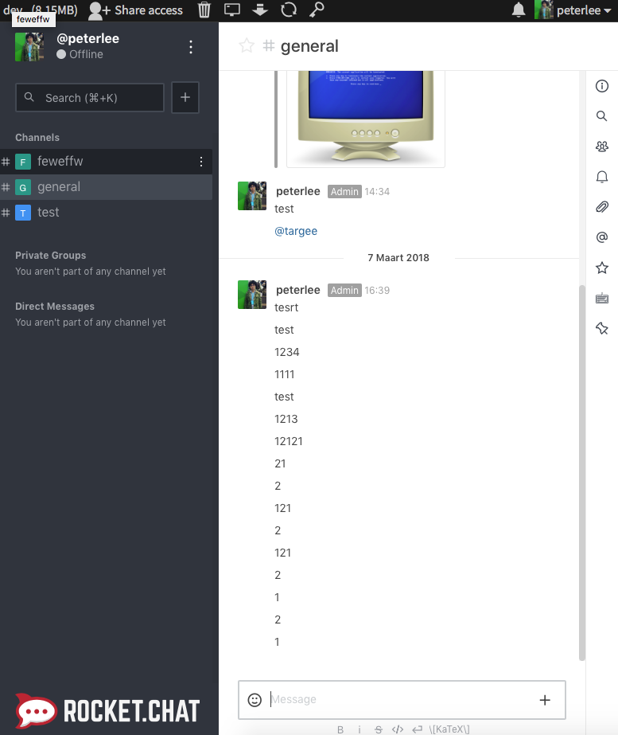

# RocketChat-for-Sandstorm


Due to no new update for RocketChat on Sandstorm [URL](https://apps.sandstorm.io/app/vfnwptfn02ty21w715snyyczw0nqxkv3jvawcah10c6z7hj1hnu0).

This is new build RocketChat package for Sandstorm

Features:   
1. Update 0.61.0-develop.  
2. Fix mobile app push notification.   


```
# access the sandstorm's db
$ sudo sandstorm mongo 

# access the db meteor
use meteor

# change your old RocketChat grain to new build 
db.grains.update({_id: "<your-grain-id>"}, {$set: {appId: "<new-app-id>", packageId: "<new-package-id>"}})

```
## Update to 0.61-dev 
```
db.grains.update({_id: "<your-grain-id>"}, {$set: {appId: "ju1kvq90sv9vshju8crnjfu4nm85ur1xvq0mkp7cmh5237xwe35h", packageId: "b934767edd8e6aa761d1807d2f442b21"}})
```
    
    
